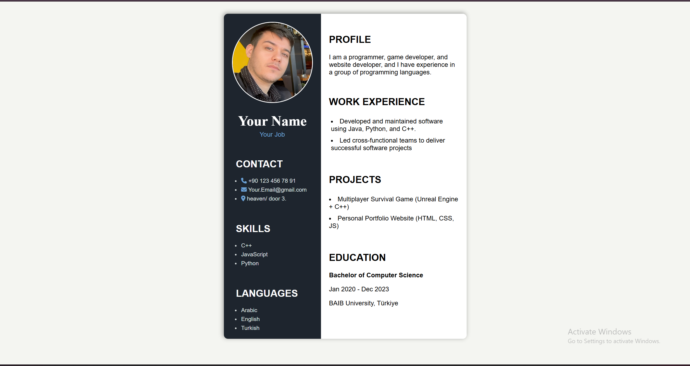

# Modern Personal CV Website

A simple and modern **personal CV website** built using **HTML** and **CSS**.  
It provides a professional layout to showcase personal details, skills, work experience, and projects.

---

## Preview

---

## Live Demo
[View Website](https://saad-alagele.github.io/Modern-Personal-CV-Website/)

---

## Features

- **Clean two-column layout**: Personal details on the left, experience and projects on the right.
- **Fully customizable**: Easily update your name, contact info, skills, and projects.
- **Lightweight and fast**: Pure HTML and CSS with no extra frameworks.
- **Responsive-friendly**: Works well on desktop and can be adapted for mobile.

---

## Technologies Used

- **HTML5**
- **CSS3**
- **Font Awesome** (for icons)

---

## File Structure

